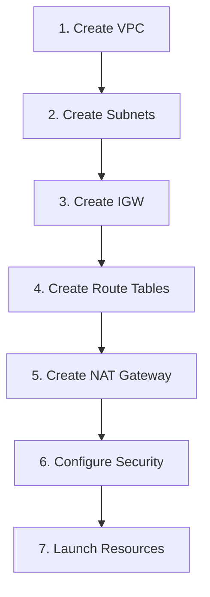

# 🎯 **AWS VPC MASTER GUIDE**  
*Everything you need to know about AWS Virtual Private Cloud*

---

## 📖 **TABLE OF CONTENTS**
1. [What is a VPC?](#-what-is-a-vpc)
2. [Core Components](#-core-components)
3. [Step-by-Step VPC Creation](#-step-by-step-vpc-creation)
4. [Public vs Private Subnets](#-public-vs-private-subnets-demystified)
5. [The Magic of Route Tables](#-the-magic-of-route-tables)
6. [Internet Gateway vs NAT Gateway](#-internet-gateway-vs-nat-gateway)
7. [Why NAT Needs Elastic IP](#-why-nat-needs-elastic-ip)
8. [Security Layers](#-security-layers)
9. [Production Architecture](#-production-architecture)
10. [Best Practices](#-best-practices)
11. [Common Mistakes](#-common-mistakes)
12. [Quick Reference](#-quick-reference)

---

## 🏢 **What is a VPC?**

A **Virtual Private Cloud (VPC)** is your **private network** inside AWS.

### **Simple Analogy:**
Think of AWS as a huge apartment building:
- **AWS Region** = The entire building
- **Availability Zone** = Different floors (isolated)
- **VPC** = Your private apartment unit
- **Subnets** = Rooms in your apartment (bedroom, kitchen)
- **Security Groups** = Door locks on each room

### **Key Characteristics:**
- ✅ **Isolated:** Your VPC is separate from other customers
- ✅ **Customizable:** Choose your own IP range
- ✅ **Secure:** Control all network traffic
- ✅ **Flexible:** Connect to on-premises or other VPCs

---

## 🧱 **Core Components**

### **1. CIDR Block (Your IP Range)**
- **Format:** `10.0.0.0/16`
- **Meaning:** All IPs from `10.0.0.0` to `10.0.255.255`
- **Total IPs:** ~65,536

| CIDR Notation | Example Range | Number of IPs | Use Case |
|--------------|---------------|--------------|----------|
| `/16` | 10.0.0.0 - 10.0.255.255 | 65,536 | Medium VPC |
| `/24` | 10.0.1.0 - 10.0.1.255 | 256 | Subnet |
| `/20` | 10.0.0.0 - 10.0.15.255 | 4,096 | Large subnet |

⚠️ **Warning:** Choose wisely! You can't easily change CIDR later.

### **2. Subnets (Your Network Segments)**
Subnets are **smaller networks** inside your VPC.

**Why multiple subnets?**
- **Security:** Separate public/private resources
- **High Availability:** Spread across Availability Zones
- **Organization:** Group similar resources

### **3. Availability Zones (AZs)**
- **What:** Physically separate data centers
- **Example:** `us-east-1a`, `us-east-1b`, `us-east-1c`
- **Best Practice:** Deploy across multiple AZs for resilience

---

## 🏗️ **Step-by-Step VPC Creation**

### **🚀 The 7-Step VPC Creation Flow**



### **Step 1: Create VPC**
```yaml
VPC:
  Name: my-vpc
  IPv4 CIDR: 10.0.0.0/16
  Tenancy: Default
```

### **Step 2: Create Subnets**
```yaml
Public Subnets:
  - 10.0.1.0/24 (us-east-1a)
  - 10.0.2.0/24 (us-east-1b)

Private Subnets:
  - 10.0.3.0/24 (us-east-1a)
  - 10.0.4.0/24 (us-east-1b)
```

### **Step 3: Create Internet Gateway (IGW)**
- **Action:** Create IGW → Attach to VPC
- **Purpose:** Internet ↔ VPC communication
- **Note:** One IGW per VPC

### **Step 4: Create Route Tables**
```yaml
Public Route Table:
  Routes:
    - 10.0.0.0/16 → local
    - 0.0.0.0/0 → igw-12345
  Associated Subnets: Public Subnets

Private Route Table:
  Routes:
    - 10.0.0.0/16 → local
    - 0.0.0.0/0 → nat-12345
  Associated Subnets: Private Subnets
```

### **Step 5: Create NAT Gateway**
```yaml
NAT Gateway:
  Location: Public Subnet
  Elastic IP: Required
  Purpose: Private subnet → Internet
```

### **Step 6: Configure Security**
- Security Groups (Instance firewall)
- Network ACLs (Subnet firewall)

### **Step 7: Launch Resources**
```yaml
Public EC2:
  Subnet: Public
  Public IP: Yes
  Security Group: Allow HTTP/HTTPS

Private EC2:
  Subnet: Private  
  Public IP: No
  Security Group: Allow SSH from bastion
```

---

## 🔓 **Public vs Private Subnets Demystified**

### **🤔 Common Misconception**
> ❌ "A subnet is public because I put it in a public subnet"
> ❌ "A subnet is public because it has an Internet Gateway"
> ✅ **TRUTH:** A subnet is public/private **ONLY because of its ROUTE TABLE**

### **The Real Difference:**

| Characteristic | Public Subnet | Private Subnet |
|----------------|---------------|----------------|
| **Route Table** | Has route to IGW | Has route to NAT (or no internet route) |
| **Internet Access** | ✅ Inbound & Outbound | ✅ Outbound only via NAT |
| **Public IP Needed** | ✅ Yes | ❌ No |
| **Use Case** | Load Balancers, Bastion | Databases, Backend Servers |
| **Security** | Exposed to internet | Protected, no direct internet access |

### **Visual Example:**
```
VPC (10.0.0.0/16)
├── Public Subnet (10.0.1.0/24)
│   ├── Route: 0.0.0.0/0 → IGW  ← MAKES IT PUBLIC!
│   ├── EC2 with Public IP
│   └── NAT Gateway
│
└── Private Subnet (10.0.2.0/24)
    ├── Route: 0.0.0.0/0 → NAT  ← MAKES IT PRIVATE!
    └── EC2 without Public IP
```

---

## 🧭 **The Magic of Route Tables**

### **What is a Route Table?**
A **GPS for network traffic** inside your VPC.

### **How It Works:**
```
Question: "Where should this packet go?"
Answer: Check Route Table
```

### **Default Route (Always Present)**
```yaml
Destination: 10.0.0.0/16
Target: local
Meaning: "Traffic within VPC stays in VPC"
```

### **Public Subnet Route Table**
```yaml
Routes:
  - 10.0.0.0/16 → local
  - 0.0.0.0/0   → igw-12345  # Internet traffic goes to IGW
```

### **Private Subnet Route Table**
```yaml
Routes:
  - 10.0.0.0/16 → local
  - 0.0.0.0/0   → nat-12345  # Internet traffic goes to NAT
```

### **🔑 Golden Rule**
> **Route tables decide WHERE traffic goes**  
> **Security Groups decide IF traffic is allowed**

---

## 🌐 **Internet Gateway vs NAT Gateway**

### **Internet Gateway (IGW)**
**Analogy:** Front door of your house (two-way)

```yaml
Internet Gateway:
  Type: Two-way door
  Function: Internet ↔ VPC
  Attachment: VPC (not subnet!)
  Cost: Free
  Use: Public subnets
```

**Traffic Flow:**
```
Internet ↔ IGW ↔ Public EC2
```

### **NAT Gateway**
**Analogy:** One-way window (only outbound)

```yaml
NAT Gateway:
  Type: One-way window
  Function: Private subnet → Internet
  Location: Public subnet
  Requirement: Elastic IP (required!)
  Cost: ~$0.045/hour + data
  Use: Private subnets
```

**Traffic Flow:**
```
Private EC2 → NAT → Internet
Internet → ❌ Cannot reach Private EC2
```

### **Comparison Table:**

| Feature | Internet Gateway | NAT Gateway |
|---------|-----------------|-------------|
| **Direction** | Two-way (In/Out) | One-way (Out only) |
| **Location** | Attached to VPC | In Public Subnet |
| **Elastic IP** | Optional | Required |
| **Cost** | Free | Hourly + Data |
| **Purpose** | Public resources | Private resources need internet |
| **Security** | Less secure | More secure |

---

## 🎯 **Why NAT Needs Elastic IP**

### **The Problem:**
Private EC2 has IP `10.0.2.15` (private, non-routable on internet)  
When it requests `google.com`, how does the response come back?

### **The Solution: NAT with Elastic IP**
```
Step 1: Private EC2 (10.0.2.15) → Request → Google
Step 2: NAT changes source IP: 10.0.2.15 → 54.23.10.8 (Elastic IP)
Step 3: Internet sees request from 54.23.10.8
Step 4: Google replies to 54.23.10.8
Step 5: NAT changes destination: 54.23.10.8 → 10.0.2.15
Step 6: Private EC2 receives response 🎉
```

### **Why Elastic IP (not regular Public IP)?**

| IP Type | Static? | Suitable for NAT? |
|---------|---------|-------------------|
| **Regular Public IP** | Changes on stop/start | ❌ No (breaks connections) |
| **Elastic IP** | Permanent, never changes | ✅ Yes (stable endpoint) |

### **Real-World Example:**
```python
# Without Elastic IP (BROKEN)
private_ec2.ip = "10.0.2.15"
nat.ip = "54.23.10.8"  # Today
# Tomorrow after restart:
nat.ip = "54.23.11.9"  # Different!
# Google replies to 54.23.10.8 → LOST! ❌

# With Elastic IP (WORKS)
private_ec2.ip = "10.0.2.15"
nat.elastic_ip = "54.23.10.8"  # Always this IP
# Always works! ✅
```

### **💡 Memory Trick:**
> **IGW** = Your house's front door (anyone can knock)  
> **NAT** = Your mail slot (only outbound mail)  
> **Elastic IP** = Your permanent return address on letters

---

## 🔐 **Security Layers**

### **1. Security Groups (Instance Firewall)**
- **Level:** Instance/ENI level
- **Stateful:** If inbound allowed, outbound automatically allowed
- **Rules:** Allow only (no deny rules)
- **Example:**
```yaml
Security Group Rules:
  - Type: SSH, Port: 22, Source: 192.168.1.1/32
  - Type: HTTP, Port: 80, Source: 0.0.0.0/0
```

### **2. Network ACLs (Subnet Firewall)**
- **Level:** Subnet level
- **Stateless:** Must allow both inbound AND outbound
- **Rules:** Both Allow and Deny
- **Example:**
```yaml
Network ACL Rules:
  Inbound:
    - Rule 100: Allow HTTP from anywhere
    - Rule 200: Deny SSH from 10.0.0.0/16
  Outbound:
    - Rule 100: Allow all
```

### **Comparison:**

| Feature | Security Group | Network ACL |
|---------|---------------|-------------|
| **Level** | Instance | Subnet |
| **Stateful** | ✅ Yes | ❌ No |
| **Rule Types** | Allow only | Allow & Deny |
| **Evaluation** | All rules evaluated | Rules in order |
| **Common Use** | Always used | Extra security layer |

### **Traffic Path:**
```
Internet → IGW → Route Table → NACL → Security Group → EC2
```

---

## 🏭 **Production Architecture**

### **Multi-AZ Production VPC**
```
VPC: 10.0.0.0/16

Availability Zone A:
├── Public Subnet (10.0.1.0/24)
│   ├── NAT Gateway A
│   ├── Application Load Balancer
│   └── Bastion Host
│
└── Private Subnet (10.0.3.0/24)
    ├── Application Servers
    └── Cache (Redis)

Availability Zone B:
├── Public Subnet (10.0.2.0/24)
│   ├── NAT Gateway B
│   └── Application Load Balancer
│
└── Private Subnet (10.0.4.0/24)
    ├── Application Servers
    └── Database (Read Replica)
```

### **Key Design Principles:**
1. **Multi-AZ:** Always deploy across at least 2 AZs
2. **Private Everything:** Only load balancers and bastions in public subnets
3. **NAT per AZ:** One NAT Gateway per AZ (avoids cross-AZ charges)
4. **Tiered Architecture:** Web → App → DB separation

---

## 📋 **Best Practices**

### **✅ DO:**
1. **Plan CIDR carefully** - Can't change easily
2. **Use private subnets** for databases/backends
3. **One NAT per AZ** for high availability
4. **Tag everything** for cost tracking
5. **Use VPC endpoints** for AWS services (reduces NAT costs)
6. **Least privilege** security groups
7. **Multi-AZ deployment** for high availability

### **❌ DON'T:**
1. **Don't use default VPC** for production
2. **Don't put databases in public subnets**
3. **Don't use 0.0.0.0/0** in security groups unless necessary
4. **Don't forget to clean up** unused Elastic IPs (they cost money!)
5. **Don't skip NACLs** in regulated environments

### **💰 Cost Optimization:**
1. **VPC Endpoints:** Use for S3, DynamoDB (free/cheap)
2. **NAT Gateway:** Consider NAT Instance for dev (cheaper)
3. **AZ Selection:** Some AZs might be cheaper
4. **Cleanup:** Always delete unused resources

---

## ⚠️ **Common Mistakes**

### **Mistake 1: "My EC2 has no internet access"**
**Checklist:**
- [ ] Is it in a public subnet? (Route table → IGW)
- [ ] Does it have a public IP?
- [ ] Does Security Group allow outbound?
- [ ] Is NACL blocking traffic?

### **Mistake 2: "Internet can't reach my web server"**
**Checklist:**
- [ ] Public subnet? (Route table → IGW)
- [ ] Public IP assigned?
- [ ] Security Group allows port 80/443?
- [ ] NACL allows inbound/outbound?

### **Mistake 3: "Private EC2 can't download updates"**
**Checklist:**
- [ ] Private subnet route → NAT?
- [ ] NAT Gateway exists and is healthy?
- [ ] NAT in public subnet?
- [ ] NAT has Elastic IP?

### **Mistake 4: "Can't SSH to private instance"**
**Solution:**
1. SSH to bastion (public instance)
2. From bastion, SSH to private instance
3. Or use AWS Systems Manager (no bastion needed)

---

## 📖 **Quick Reference**

### **VPC Creation Cheat Sheet:**
```bash
1. VPC: 10.0.0.0/16
2. Subnets:
   - Public: 10.0.1.0/24 (az-a), 10.0.2.0/24 (az-b)
   - Private: 10.0.3.0/24 (az-a), 10.0.4.0/24 (az-b)
3. IGW: Create & attach to VPC
4. Route Tables:
   - Public: 0.0.0.0/0 → IGW
   - Private: 0.0.0.0/0 → NAT
5. NAT: In public subnet with Elastic IP
6. Security: Configure SGs & NACLs
```

### **Traffic Flow Rules:**
```
From           To           Requirements
-------------  -----------  -----------------------------------
Internet       Public EC2   1. Public subnet 2. Public IP 3. SG allows
Public EC2     Internet     Route → IGW, SG allows outbound
Private EC2    Internet     Route → NAT, NAT in public subnet
Internet       Private EC2  ❌ NOT POSSIBLE (by design)
Bastion        Private EC2  SG allows SSH from bastion SG
Private EC2    Private EC2  Same VPC (local route)
```

### **Cost Summary:**
| Resource | Cost | Notes |
|----------|------|-------|
| VPC | Free | |
| Subnets | Free | |
| Internet Gateway | Free | |
| NAT Gateway | ~$32/month | + data transfer |
| Elastic IP | ~$3.60/month | If not attached |
| Data Transfer | Variable | Outbound to internet |

---

## 🎓 **Learning Path**

### **Week 1: Foundation**
1. Create VPC with public/private subnets
2. Launch EC2 in each subnet
3. Test connectivity
4. Clean up

### **Week 2: Advanced**
1. Add NAT Gateway
2. Configure Security Groups & NACLs
3. Set up VPC peering
4. Create VPN connection

### **Week 3: Production**
1. Multi-AZ deployment
2. VPC endpoints
3. Transit Gateway
4. Network monitoring

---

## ❓ **FAQ**

### **Q: Can I change VPC CIDR later?**
**A:** No, plan carefully! You can add secondary CIDRs, but primary can't be changed.

### **Q: How many subnets per VPC?**
**A:** Up to 200, but typical production: 6-12 (public/private across 3 AZs).

### **Q: NAT Gateway vs NAT Instance?**
**A:** 
- **NAT Gateway:** Managed, scalable, production-ready
- **NAT Instance:** Cheaper, more control, for labs/dev

### **Q: When to use VPC endpoints?**
**A:** When private resources need AWS services (S3, DynamoDB) without internet access.

### **Q: How to connect two VPCs?**
**A:** VPC Peering (same region), Transit Gateway (complex networks), VPN (cross-account/region).

---

## 🚀 **Next Steps**

1. **Hands-on Practice:** Create 3-tier architecture (Web → App → DB)
2. **Automation:** Learn Terraform/CloudFormation for VPC
3. **Security:** Implement network policies and monitoring
4. **Certification:** AWS Solutions Architect Associate

---

## 📚 **Resources**

### **Official Documentation:**
- [AWS VPC User Guide](https://docs.aws.amazon.com/vpc/latest/userguide/)
- [VPC Best Practices](https://docs.aws.amazon.com/vpc/latest/userguide/vpc-best-practices.html)
- [VPC Pricing](https://aws.amazon.com/vpc/pricing/)

### **Training:**
- [AWS Skill Builder - VPC](https://explore.skillbuilder.aws/learn)
- [A Cloud Guru](https://acloudguru.com)
- [Udemy AWS Courses](https://www.udemy.com)

### **Tools:**
- [VPC Reachability Analyzer](https://docs.aws.amazon.com/vpc/latest/reachability/)
- [Network Manager](https://aws.amazon.com/network-manager/)
- [CloudFormation VPC Templates](https://docs.aws.amazon.com/AWSCloudFormation/latest/UserGuide/aws-resource-ec2-vpc.html)

---

## 🎉 **Congratulations!**
You now understand AWS VPC at a professional level. Remember:

> **VPC is the foundation of everything in AWS.**  
> Master this, and you've mastered cloud networking.

**Keep practicing, keep building, and don't be afraid to break things (in a sandbox)!**

---

*Last updated: January 2025 | AWS Region: All | Difficulty: Beginner to Advanced*
